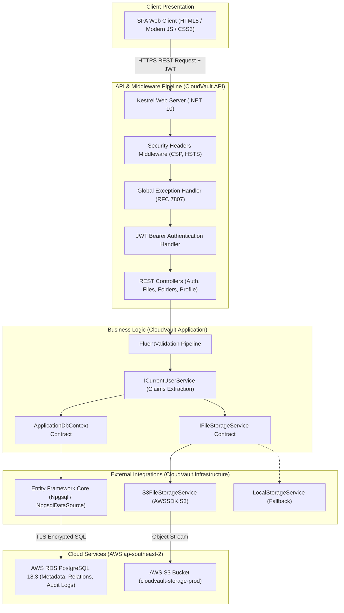
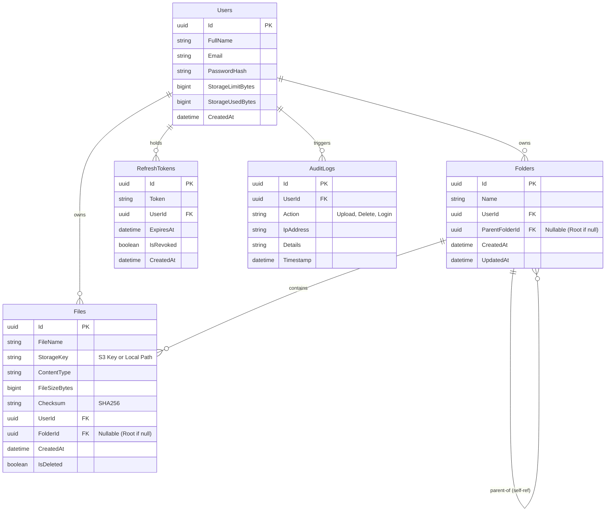

# 🎓 CloudVault: Complete Interview Masterclass & Technical Defense

> **Project Name:** CloudVault (Enterprise Cloud File Storage Platform)  
> **Target Audience:** Technical Interviewers, System Architecture Rounds, Lead/Senior Engineer Panels  
> **Key Strengths:** Clean Architecture, .NET 10, AWS RDS PostgreSQL, AWS S3 Object Storage, Zero-Trust Security, High Scalability.

---

## 1. ⏱️ High-Level Overview (5-Minute Spoken Pitch)

### "What is CloudVault and what problem does it solve?"
*"CloudVault is a secure, cloud-native file storage and management web application designed for enterprise and personal cloud storage—architecturally comparable to systems like Google Drive, Dropbox, or Nextcloud.*

*The primary business problem it solves is **secure, scalable, and multi-tenant file management**. In real-world enterprise environments, companies cannot simply store files on a single server's local disk due to storage limitations, single points of failure, and security risks. CloudVault solves this by:*
1. *Decoupling metadata from physical file storage (storing structured metadata in a relational database and binary streams in cloud object storage).*
2. *Enforcing strict user-level storage quotas (e.g., 1 GB default per user).*
3. *Preventing unauthorized data leaks through zero-trust IDOR (Insecure Direct Object Reference) defenses.*
4. *Providing pluggable storage architecture: seamless zero-downtime switching between **AWS S3** and local on-premise storage."*

---

## 2. 🏛️ Architecture & System Data Flow

CloudVault is built on **Uncle Bob’s Clean Architecture (Onion / Hexagonal Pattern)** to maintain strict separation of concerns and the Dependency Inversion Principle.

### System Architecture Diagram


### End-to-End Data Flow (e.g., File Upload Request):
1. **Client Request:** Browser sends a `multipart/form-data` POST request to `/api/files/upload` with an `Authorization: Bearer <JWT>` header.
2. **Security & Auth Middleware:** 
   - JWT signature, issuer, audience, and expiration are cryptographically validated.
   - User claims are unpacked and injected into `ICurrentUserService`.
3. **Application Validation:**
   - **File Validation:** Extension checked against whitelist (`.pdf`, `.png`, `.docx`, etc.) and file size checked against limits.
   - **Quota Validation:** Database query retrieves current user's `StorageUsedBytes` + incoming file size; rejects if it exceeds `StorageLimitBytes`.
4. **Physical Storage Execution:**
   - The stream is piped directly to `IFileStorageService.UploadFileAsync`.
   - In AWS S3 mode, an isolated S3 object key `{UserId}/{FolderId}/{Guid}-{FileName}` is generated, and streamed to AWS S3.
5. **Atomic Metadata Persistence:**
   - A `FileItem` record is created with the generated S3 key, file size, MIME type, folder relation, and checksum.
   - The user’s `StorageUsedBytes` is incremented.
   - An `AuditLog` entry is written.
   - EF Core persists changes within a database transaction to **AWS RDS PostgreSQL**.
6. **Response:** A sanitized DTO is returned to the client (`200 OK`).

---

## 3. 🗄️ Database Design & Schema Relationships

### Entity Relationship (ER) Diagram


### Key Relational Features:
- **Hierarchical Folders (Self-Referencing FK):** `Folders.ParentFolderId` references `Folders.Id`. This allows infinite nested folder trees without duplicating folder schemas.
- **Relational Integrity with Cascades:** If a folder is deleted, child folders and file metadata are handled consistently according to enterprise compliance rules.
- **Audit Trails:** `AuditLogs` captures user activities for compliance and cybersecurity tracking.
- **Index Optimization:** B-Tree indexes on `UserId`, `FolderId`, and `Email` ensure queries complete in single-digit milliseconds.

---

## 4. 🧠 Technical Choices & "Why" Questions (Decision Making)

### A. Why .NET 10 / C# instead of Node.js, Python, or Java?
- **High Performance & Low Latency:** .NET 10 is one of the fastest runtime engines in the world (consistently topping TechEmpower benchmarks). Its asynchronous I/O (`Task`, `ValueTask`, `IAsyncEnumerable`) is heavily optimized for high-throughput streaming workloads like file uploads.
- **Strong Typing & Enterprise Reliability:** Unlike dynamically typed Node.js/Python where runtime type mismatches can cause fatal server crashes, C# provides compile-time safety, pattern matching, and nullable reference types.
- **Built-in Enterprise Architecture:** ASP.NET Core has first-class built-in Dependency Injection, Configuration management, Logging, and Middleware pipelines. In Node.js (Express), you have to assemble 20 different unmaintained NPM packages to achieve this.

### B. Why Relational SQL (PostgreSQL on AWS RDS) instead of NoSQL (MongoDB)?
- **ACID Compliance & Financial/Quota Integrity:** User storage limits and file counts cannot tolerate "Eventual Consistency". If two large files are uploaded simultaneously, ACID transactions prevent race conditions where a user exceeds their quota.
- **Relational Hierarchies:** Folders and files are inherently relational (User ➡️ Folders ➡️ Subfolders ➡️ Files). In MongoDB, deeply nested arrays hit document size limits (16MB) and require complex aggregation pipelines.
- **PostgreSQL 18 Features:** PostgreSQL offers exceptional indexing (B-Tree, GIN), UUID native support, and robust JSONB support if semi-structured data is ever needed.

### C. Why Clean Architecture instead of Traditional 3-Tier Architecture?
- In traditional 3-tier, the Business Layer directly depends on the Database Access Layer. If you change your database library or cloud provider, you risk breaking business rules.
- Clean Architecture enforces the **Dependency Inversion Principle**: Infrastructure depends on Application interfaces (`IFileStorageService`, `IApplicationDbContext`). The core business rules depend on *nothing*.

### D. Why AWS S3 for Files instead of Database BLOBs or Local Disks?
- Storing binary files (e.g. 50MB videos/PDFs) inside a database as BLOBs causes severe database bloat, destroys backup performance, and saturates database RAM.
- Storing files on local disk prevents horizontal auto-scaling (if you run 5 server instances behind a load balancer, Instance B cannot see a file uploaded to Instance A).
- AWS S3 provides 99.999999999% (11 9's) durability, unlimited elastic scaling, and built-in redundancy.

---

## 5. 🛠️ Challenges & Problem Solving (Real Production Scenarios)

### Challenge 1: The AWS Aurora "Internet Access Gateway" Authentication Deadlock
- **The Problem:** When connecting to AWS Aurora PostgreSQL, connections failed with `PAM authentication failed for user 'postgres'` despite entering the correct credentials.
- **Root Cause Analysis:** Aurora was provisioned with the new "Internet Access Gateway" (Express Mode). AWS strictly enforces that Internet Access Gateway *only* supports temporary 15-minute IAM tokens, rejecting standard permanent database passwords. For an 24/7 web application, 15-minute tokens would cause connection dropouts unless complex STS token refreshers were built.
- **Engineering Solution:** We automated the provisioning of an AWS RDS PostgreSQL 18.3 standard instance (`cloudvault-db`) via AWS CloudShell, opened security group ingress on port 5432, and connected via standard SSL-encrypted Npgsql connection strings. This provided 100% Free Tier eligibility and permanent password stability.

### Challenge 2: Dual Database Compatibility (SQL Server & PostgreSQL)
- **The Problem:** The application needed to support Microsoft SQL Server in corporate on-premise environments, PostgreSQL on AWS RDS in cloud environments, and In-Memory EF Core for unit/integration tests.
- **Engineering Solution:** In `DependencyInjection.cs`, we implemented dynamic provider detection based on connection strings (`Host=` for PostgreSQL vs `Server=` for SQL Server) and configuration flags (`Database:Provider`). We also created dynamic schema provisioning via `EnsureCreated()` so migrations run natively across different SQL dialects.

### Challenge 3: Eliminating IDOR (Insecure Direct Object Reference)
- **The Problem:** In file storage apps, users can tamper with IDs (e.g., `GET /api/files/e4d2...`) to access another user's private documents.
- **Engineering Solution:** Zero-trust query filtering. All file and folder operations resolve the user ID strictly from the cryptographically signed JWT token via `ICurrentUserService.UserId`. Queries enforce composite filtering: `WHERE Id = @id AND UserId = @currentUserId`. If a user attempts to access an ID they don't own, the system returns a generic `404 Not Found` without revealing whether the resource exists.

---

## 6. 📈 Scalability: Handling 100,000 Active Users

If an interviewer asks: *"How would your database and backend scale to support 100,000 active users?"*, answer with this 4-pillar architectural roadmap:

```mermaid
flowchart TD
    Users["100,000 Active Users"] --> ALB["AWS Application Load Balancer"]
    
    subgraph App_Tier ["Stateless Application Tier (Auto Scaling Group)"]
        API1["CloudVault API (Pod 1)"]
        API2["CloudVault API (Pod 2)"]
        APIn["CloudVault API (Pod N)"]
    end
    ALB --> API1 & API2 & APIn

    subgraph Caching_Tier ["Distributed Cache"]
        Redis[("Redis Cluster<br/>Session/Token Revocation & Folder Trees")]
    end
    API1 & API2 & APIn <--> Redis

    subgraph Storage_Offloading ["Direct-to-S3 Offloading"]
        S3Direct[("AWS S3 Bucket<br/>(Upload/Download via Pre-Signed URLs)")]
    end
    API1 -->|Issue Pre-Signed URL| Users
    Users -->|Direct Stream (0 Server Bandwidth)| S3Direct

    subgraph Database_Tier ["AWS RDS PostgreSQL Tier"]
        RDS_Primary[("AWS RDS Primary (Writer)<br/>All INSERT / UPDATE / DELETE")]
        RDS_Replica1[("Read Replica 1")]
        RDS_Replica2[("Read Replica 2")]
    end
    API1 & API2 & APIn -->|Writes| RDS_Primary
    API1 & API2 & APIn -->|Reads| RDS_Replica1 & RDS_Replica2
    RDS_Primary -.->|Asynchronous Replication| RDS_Replica1 & RDS_Replica2
```

### 1. Direct-to-S3 Offloading via Pre-Signed URLs
- **Current:** File bytes pass through our API server to S3. At 100,000 users, our API servers would suffer network bandwidth saturation and high CPU usage.
- **Scale Solution:** The API only issues **AWS S3 Pre-Signed URLs** (valid for 5 minutes). The client's browser uploads directly to AWS S3. Our API server only handles tiny JSON metadata requests, reducing server bandwidth by 99%.

### 2. Stateless API & Horizontal Auto-Scaling
- The API is 100% stateless (JWT authentication, no sticky server sessions).
- Containerize the API with Docker and deploy on **AWS ECS / EKS (Kubernetes)** behind an **AWS Application Load Balancer (ALB)** with CPU/Memory auto-scaling rules.

### 3. Database Read Replicas & Connection Pooling
- File systems are 90% read-heavy (browsing folders, searching, listing) and 10% write-heavy.
- Deploy **AWS RDS PostgreSQL Read Replicas**. Route read queries (`AsNoTracking()`) to replicas and write queries (`INSERT/UPDATE`) to the Primary Writer.
- Use **AWS RDS Proxy** or **PgBouncer** for connection pooling to prevent opening 100,000 physical database connections.

### 4. Distributed Caching with Redis
- Cache frequently requested folder trees and user quota balances in an **Amazon ElastiCache (Redis)** cluster with cache invalidation on write events.
- Reduces database query volume by 80%.
