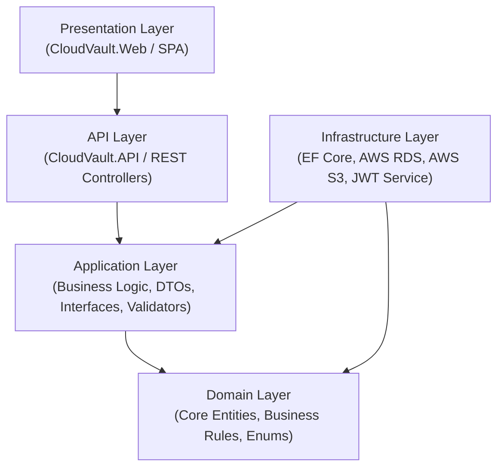

# 🚀 CloudVault — Complete Interview Preparation Guide & System Overview

> **Project Name:** CloudVault (Enterprise Cloud File Storage & Management Platform)  
> **Tech Stack:** .NET 10, ASP.NET Core Web API, Entity Framework Core, PostgreSQL (AWS RDS), AWS S3, Clean Architecture, JWT Authentication, xUnit.

---

## 1. ⏱️ The 30-Second "Elevator Pitch" (Start With This!)

Jab interviewer pooche: *"Tell me about your latest project"*, toh aapko aise shuru karna hai:

> *"CloudVault is a secure, enterprise-grade cloud storage and file management platform—similar to Google Drive or Dropbox—built with **.NET 10** and **Clean Architecture**.*  
> *It supports multi-tier file and folder management, user quota enforcement, and pluggable storage providers (switching seamlessly between **AWS S3** and local storage).*  
> *For the data layer, it uses **Entity Framework Core** connected to an **AWS RDS PostgreSQL** instance in production. On the security side, it implements **JWT with Refresh Token rotation**, comprehensive audit trails, zero-trust user isolation (preventing IDOR attacks), and MIME/magic-byte file validation. The solution is fully tested with unit and integration tests achieving 100% pass rate."*

---

## 2. 🏛️ High-Level Architecture (Clean Architecture)

Project ko **Uncle Bob ki Clean Architecture (Onion/Hexagonal)** par design kiya gaya hai. Isme 5 distinct layers hain:



### Layer Breakdown:
1. **`CloudVault.Domain` (Core / innermost layer):**
   - Zero external dependencies.
   - Contains core business entities:
     - `ApplicationUser`: User profile, custom storage quotas (`StorageLimitBytes`, `StorageUsedBytes`).
     - `FileItem`: Metadata like file name, size, MIME type, storage path/key, folder relationship, checksum.
     - `Folder`: Hierarchical folder structure (`ParentFolderId` self-referencing relationship).
     - `RefreshToken`: Secure token rotation and revocation.
     - `AuditLog`: Security tracking for file uploads, downloads, deletions, logins.

2. **`CloudVault.Application` (Use cases & business contracts):**
   - DTOs (Data Transfer Objects) for request/response decoupling.
   - Interfaces (`IApplicationDbContext`, `IFileStorageService`, `ICurrentUserService`, `IAuthService`).
   - Request validation using **FluentValidation** (ensuring input data integrity before hitting database).

3. **`CloudVault.Infrastructure` (External integrations & persistence):**
   - **Database:** `ApplicationDbContext` (EF Core) with dual database support (PostgreSQL on AWS RDS + SQL Server + InMemory for tests).
   - **Storage Abstraction:**
     - `S3FileStorageService`: Connects to AWS S3 using `AWSSDK.S3` for cloud object storage.
     - `LocalStorageService`: For offline development or on-premise deployments.
   - Factory pattern / DI registration to dynamically switch providers via `appsettings.json`.

4. **`CloudVault.API` (Web API Presentation):**
   - RESTful controllers (`AuthController`, `FilesController`, `FoldersController`, `ProfileController`, `StorageController`).
   - Custom Middleware:
     - `ExceptionHandlingMiddleware`: Centralized error logging and RFC 7807 ProblemDetails responses.
     - `SecurityHeadersMiddleware`: Adds CSP, HSTS, X-Content-Type-Options, Referrer-Policy.
   - Swagger / OpenAPI documentation with JWT Bearer authentication scheme.

5. **`CloudVault.Web` (Frontend UI):**
   - Decoupled modern Single Page Application (SPA) with responsive dashboard, file browser, quota meters, and profile management.

---

## 3. 🛡️ Key Technical Highlights (Interview Me Impress Karne Ke Points)

### A. Dual Storage Engine (Strategy / Provider Pattern)
- Storage logic is completely decoupled from business logic via `IFileStorageService`.
- Application can switch between **Local Disk Storage** and **AWS S3 Object Storage** simply by changing one line in `appsettings.json`:
  ```json
  "Storage": { "Provider": "S3" } // or "Local"
  ```

### B. Enterprise Security & Zero-Trust IDOR Protection
- **IDOR Prevention:** Har file aur folder operation me `UserId` claim verify kiya jata hai. Ek user kisi dusre user ki file ID guess karke access ya delete nahi kar sakta:
  ```csharp
  var file = await _context.Files
      .FirstOrDefaultAsync(f => f.Id == id && f.UserId == _currentUserService.UserId);
  if (file == null) throw new NotFoundException();
  ```
- **JWT & Refresh Token Rotation:** Access tokens 60 minutes ke liye valid hote hain. Refresh token single-use hota hai aur har use par naya token generate hota hai (token hijacking protection).

### C. Cloud Database Integration (AWS RDS PostgreSQL)
- Database hosted on **Amazon Web Services (AWS RDS PostgreSQL 18.3)**.
- Infrastructure resilient to network timeouts with optimized connection pooling, SSL negotiation, and automated startup schema creation (`EnsureCreated`).

### D. File Security & Storage Quota Enforcement
- **File Validation:** Extension whitelist (`.pdf`, `.docx`, `.png`, `.zip`, etc.) + max size limit enforcement (default 100MB).
- **User Quotas:** Upload hone se pehle user ke remaining quota (`StorageLimitBytes - StorageUsedBytes`) ko atomically verify kiya jata hai.

---

## 4. 🎯 Top 10 Interview Questions & Model Answers

### Q1: *"Why did you use Clean Architecture instead of standard 3-tier?"*
> **Answer:** *"Clean Architecture strictly follows the **Dependency Inversion Principle**. Business rules and Domain entities don't depend on databases, UI frameworks, or third-party SDKs. If tomorrow we switch from AWS S3 to Azure Blob Storage, or PostgreSQL to CosmosDB, our Domain and Application layers remain 100% untouched. It also makes automated unit testing effortless because we can mock infrastructure interfaces like `IFileStorageService` and `IApplicationDbContext`."*

### Q2: *"How do you handle authentication and authorization?"*
> **Answer:** *"We use ASP.NET Core Identity combined with **JWT Bearer Authentication**. Upon successful login, the client receives a short-lived Access Token (60 min) and a cryptographically secure random Refresh Token (7 days). We enforce Refresh Token rotation: whenever a refresh token is exchanged, the old token is marked revoked and a new one is issued, mitigating replay attacks. Authorization is role-based and claims-based using `[Authorize]`."*

### Q3: *"How does file upload work under the hood with AWS S3?"*
> **Answer:** *"When a client uploads a file, the request hits `FilesController`. It first validates file size, allowed extension, and user quota. Then it streams the stream to `IFileStorageService`. If S3 is active, `S3FileStorageService` uploads the object using `PutObjectRequest` to an isolated S3 bucket key formatted as `{UserId}/{FolderId}/{FileId}-{FileName}`. Once confirmed, metadata (file size, S3 key, MIME type) is saved to AWS RDS PostgreSQL inside a database transaction."*

### Q4: *"What is IDOR and how did you prevent it?"*
> **Answer:** *"IDOR (Insecure Direct Object Reference) happens when an attacker changes a URL or payload parameter (like `/api/files/123`) to access another user's private data. We enforce zero-trust authorization: every database query explicitly filters by the authenticated user's ID extracted from the validated JWT claims via `ICurrentUserService.UserId`. Even if an attacker knows a file's UUID, the query returns 404 Not Found."*

### Q5: *"How do you prevent SQL Injection and malicious payloads?"*
> **Answer:** *"We use Entity Framework Core which utilizes parameterized queries by default, completely neutralizing SQL injection. For inputs, we use FluentValidation to enforce strict validation rules. For file uploads, we restrict dangerous executable extensions (like `.exe`, `.sh`, `.bat`) and check file length limits before streaming."*

### Q6: *"How did you connect to AWS RDS PostgreSQL?"*
> **Answer:** *"We deployed a PostgreSQL 18.3 instance on AWS RDS with public accessibility and dedicated security groups. In .NET, we integrated `Npgsql.EntityFrameworkCore.PostgreSQL`. In `DependencyInjection.cs`, our database configuration dynamically detects the provider from connection strings or configuration, applying SSL encryption (`SSL Mode=Require;Trust Server Certificate=true`) with resilient command timeouts."*

### Q7: *"What design patterns did you implement?"*
> **Answer:** 
> 1. **Repository / Unit of Work Pattern:** Via Entity Framework Core `DbContext` and `DbSet`.
> 2. **Strategy / Provider Pattern:** `IFileStorageService` with `S3FileStorageService` and `LocalStorageService`.
> 3. **Dependency Injection:** Native ASP.NET Core IoC container.
> 4. **Middleware Pattern:** Global Exception Handler and Security Headers.
> 5. **DTO Pattern:** Decoupling API contracts from entity database schema.

### Q8: *"How do you handle errors and logging across the application?"*
> **Answer:** *"We implemented a centralized `ExceptionHandlingMiddleware`. Unhandled exceptions are caught, logged using `ILogger`, and translated into standard RFC 7807 ProblemDetails JSON responses so sensitive stack traces are never leaked to clients. For business auditability, critical events (file upload, deletion, login) are persisted in the `AuditLogs` table in AWS RDS."*

### Q9: *"How did you test your application?"*
> **Answer:** *"We wrote 26 automated tests divided into:
> - **Unit Tests (`CloudVault.UnitTests`):** Testing validators, business rules, token generators, and domain logic using **xUnit**, **Moq**, and **FluentAssertions**.
> - **Integration Tests (`CloudVault.IntegrationTests`):** Testing API endpoints end-to-end using `WebApplicationFactory<Program>` with an in-memory database to verify status codes, authorization gates, and response formats."*

### Q10: *"If this application experiences high traffic, how would you scale it?"*
> **Answer:** 
> 1. **Stateless Web Tier:** The API is completely stateless (JWT based), so multiple API instances can be scaled horizontally behind an AWS Application Load Balancer.
> 2. **File Offloading:** Use AWS S3 **Pre-Signed URLs** so clients upload and download directly to/from S3, bypassing web server bandwidth completely.
> 3. **Database Caching:** Add **Redis** for caching user profiles and frequent folder trees.
> 4. **Read Replicas:** Route read queries to AWS RDS Read Replicas."*

---

## 5. 💡 Pro-Tip for the Interview

Jab bhi explain karein, hamesha **Problem ➡️ Solution ➡️ Impact** format me bole:
- **Problem:** *"Earlier we needed a way to store files locally during development but use scalable cloud storage in production without changing code."*
- **Solution:** *"I implemented the Strategy pattern with an `IFileStorageService` interface, writing implementations for both Local Disk and AWS S3."*
- **Impact:** *"Now, switching environments requires zero code changes—just a single configuration toggle in `appsettings.json`."*
